## **Host & Network Penetration Testing: Post-Exploitation CTF 2**

Welcome everyone, this is my first write-up and I will demonstrate the process of the “Host & Network Penetration Testing: Post-Exploitation CTF 2” (from **INE**) penetration testing.

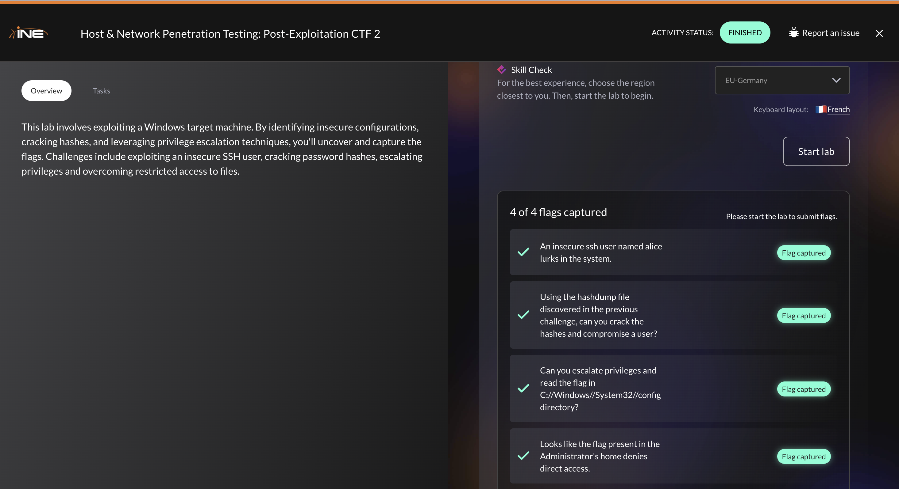

> ⚠️ This write-up is for educational purposes only.
All actions were performed in a controlled lab environment.
> 

## Reconnaissance

First, as always, we enumerate the target. An Nmap scan reveals the following open ports :

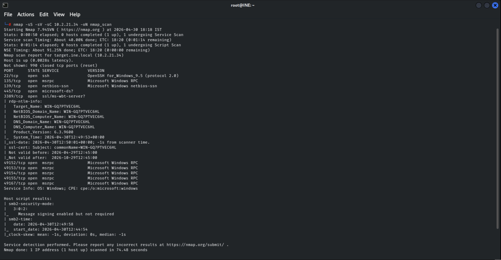
We identified that the target is running Windows and the following ports :

22 - SSH

135 - RPC

139 - NetBIOS

445 - SMB

3389 - RDP

## Initial Access

For the first flag, it was suggested that the SSH user “alice” was kinda insecure.

**Hydra** is used to perform a brute-force attack against online services. Consequently, we can use the tool against this particular user, targeting SSH:

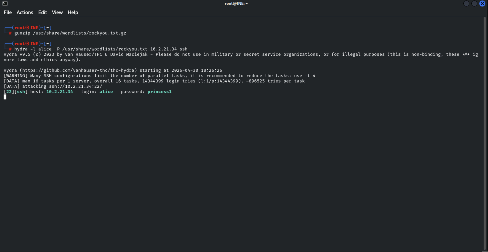

Indeed, we recovered the cleartext password, allowing us to gain initial access over the target !

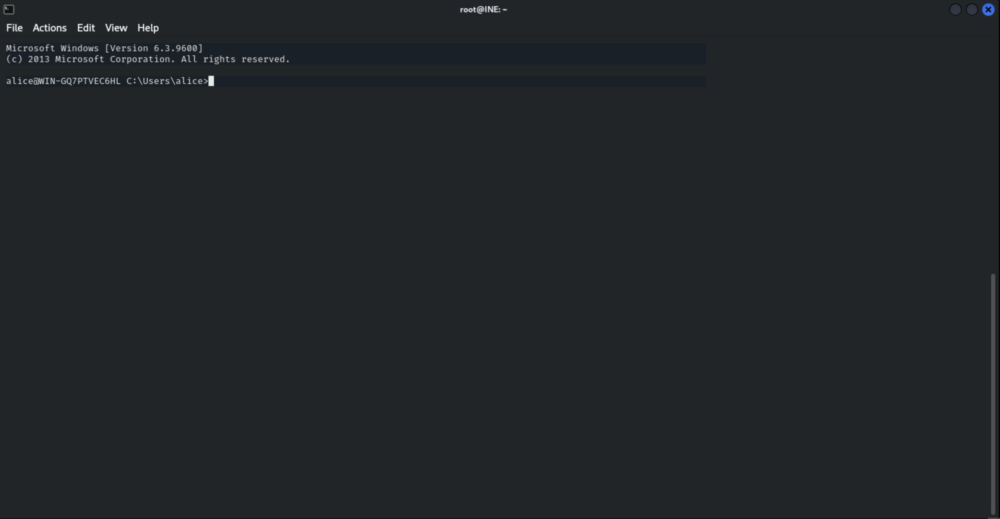

After submitting credentials via SSH, a Windows command shell is obtained. We can list the current directory and retrieve the first flag !

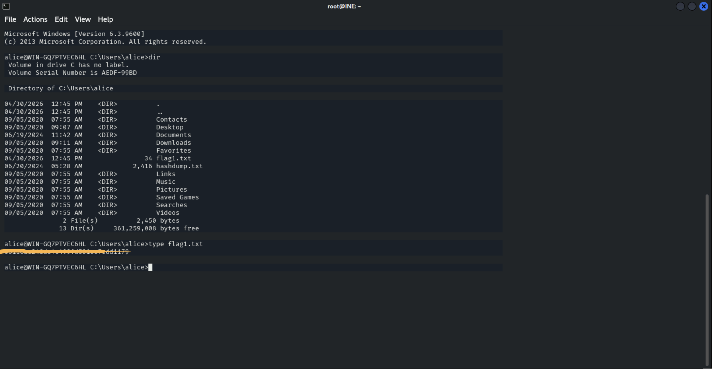

We also found an interesting file named “**hashdump.txt**” which contains multiple **NTLM hashes**:

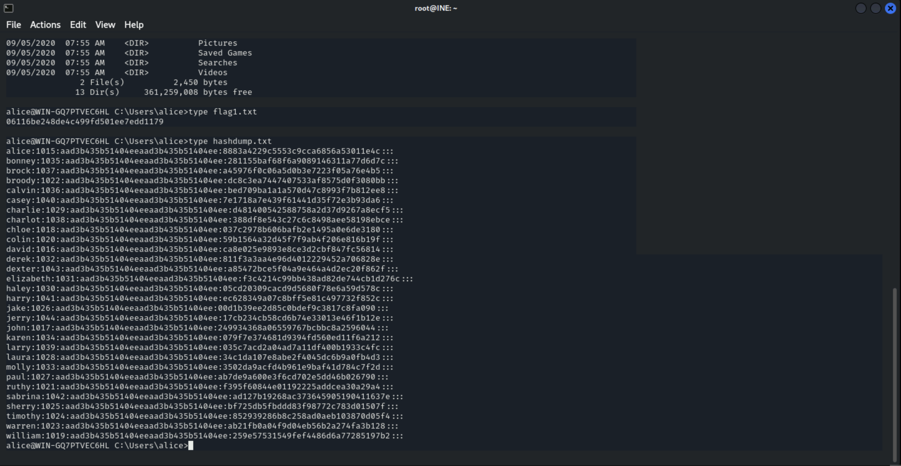

We can copy and paste the content into a local file in order to perform hash-cracking with **John the Ripper** :

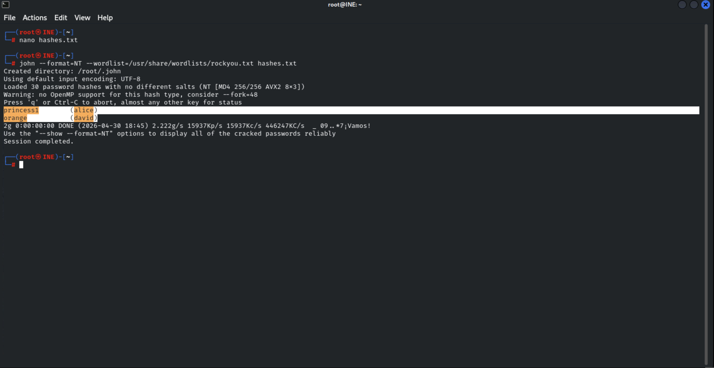

Two hashes were successfully cracked !

The cracked credentials allow us to authenticate as the user ‘david’ using the same method, allowing us to retrieve the second flag :

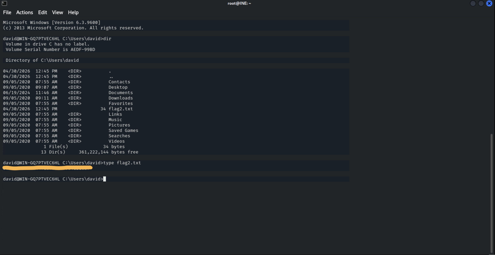

## Privilege Escalation

Checking the current privileges reveals that a critical privilege is enabled :

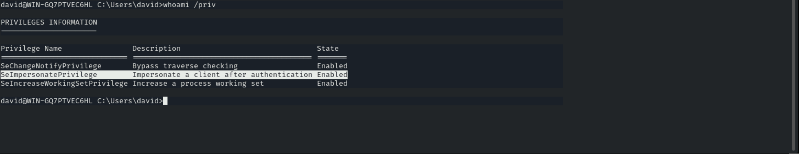

This privilege allows a user to **impersonate** another user’s token, potentially a high-privileged user.

To elevate our privileges, we will transfer **PrintSpoofer** to the target. PrintSpoofer exploits **SeImpersonatePrivilege** to impersonate a privileged token and escalate to SYSTEM. 

We transfer the binaries to the target via the **http.server** Python3 module (for Python2, we can use SimpleHTTPServer) :

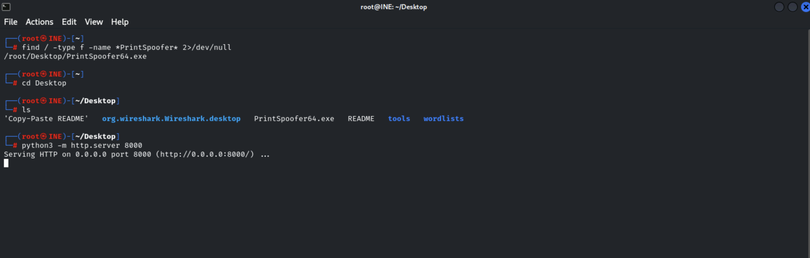

We then download the executable from the target like this :

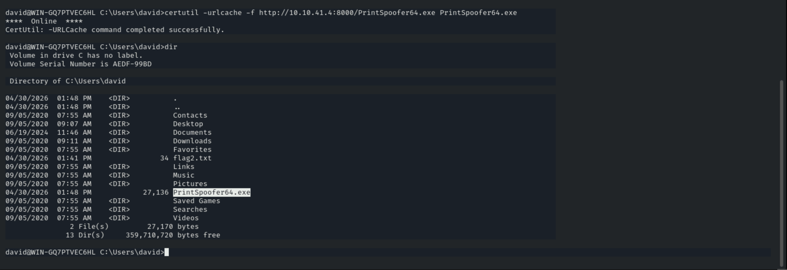

In order to execute single-command privileged, run the following command with PrintSpoofer :

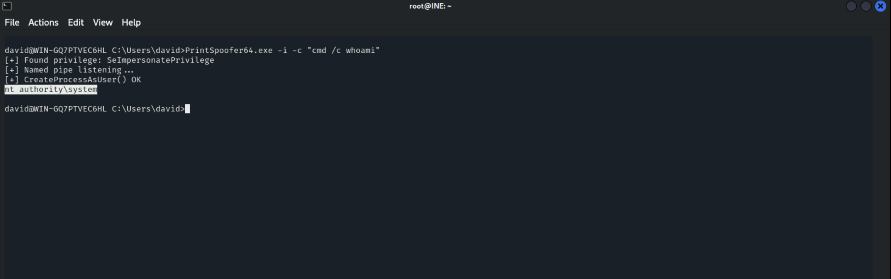

We can now execute command as SYSTEM !

Now if we want to establish a privileged session, we need to run a PowerShell reverse shell payload that will be executing with the SYSTEM privileges, resulting in a SYSTEM shell. In my case, I checked the [PayloadAllTheThings](https://swisskyrepo.github.io/InternalAllTheThings/cheatsheets/shell-reverse-cheatsheet/) Github repository and fetch the following script. We have to encode it to **base64** as well like this (make sure that you changed your IP and port): 

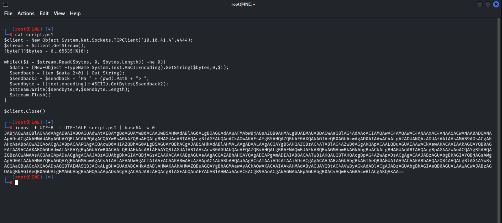

Copy the payload and run the PrintSpoofer command similarly to the previous one (make sure that your netcat listener is active and correspond to the IP and port) :

`PrintSpoofer64.exe -i -c "cmd /c powershell -enc <YOUR_PAYLOAD_HERE>"`

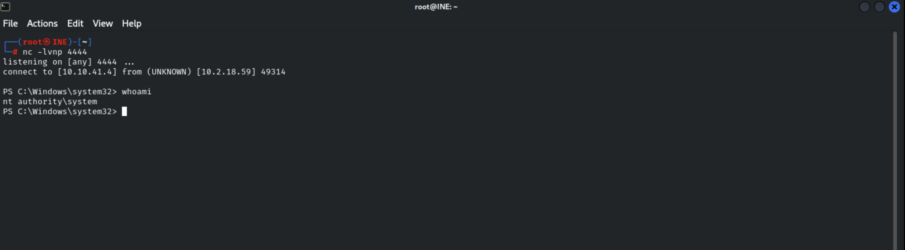

We successfully elevated our privileges !

Please note that if you don’t see the prompt you need to press enter in order to view it.

We can now fetch the third flag !

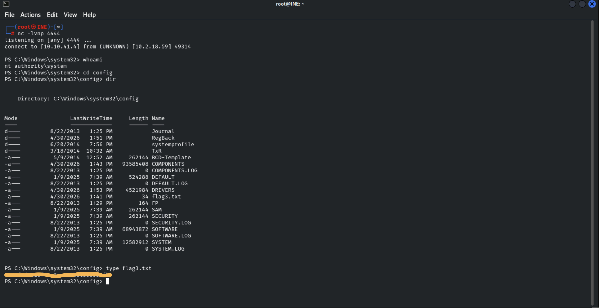

## Post-Exploitation

Well. For some reason, the last flag is inaccessible when we try to open it. It seems like an empty file, but we can see that it has a particular length.

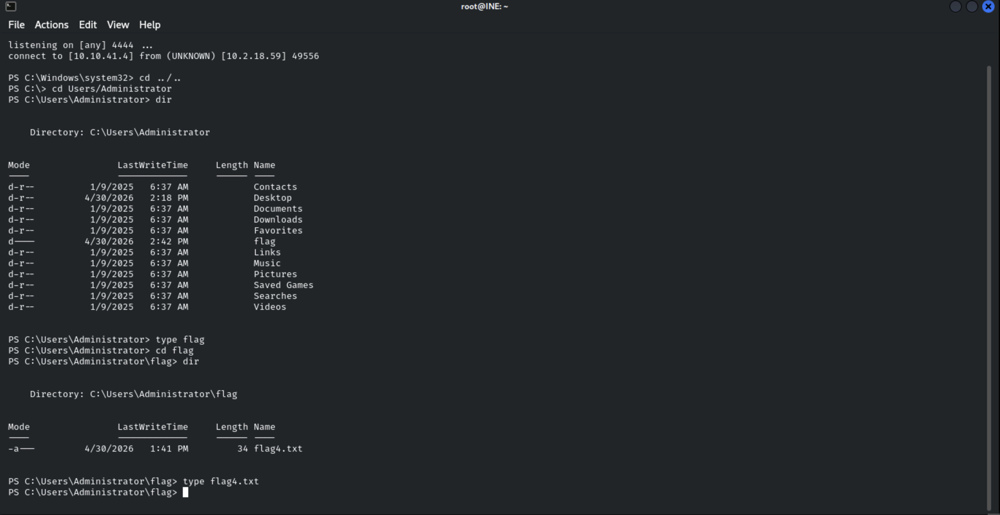

Trying with PrintSpoofer directly doesn’t work either.

This suggests that the interface does not allow proper file content retrieval. The GUI access could possibly fix this problem as it provides direct and legitimate interaction with the system. We can try to gain access via **RDP**.

As we elevated our privileges, we can create a new user and add it to the Administrators group and the RDP group :

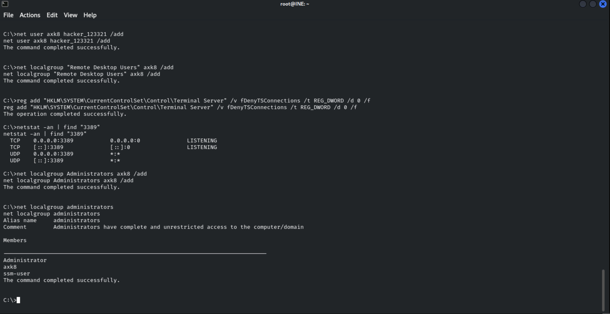

We can then connect successfully to the target through RDP via the **xfreerdp** utility, allowing us to retrieve the last flag !

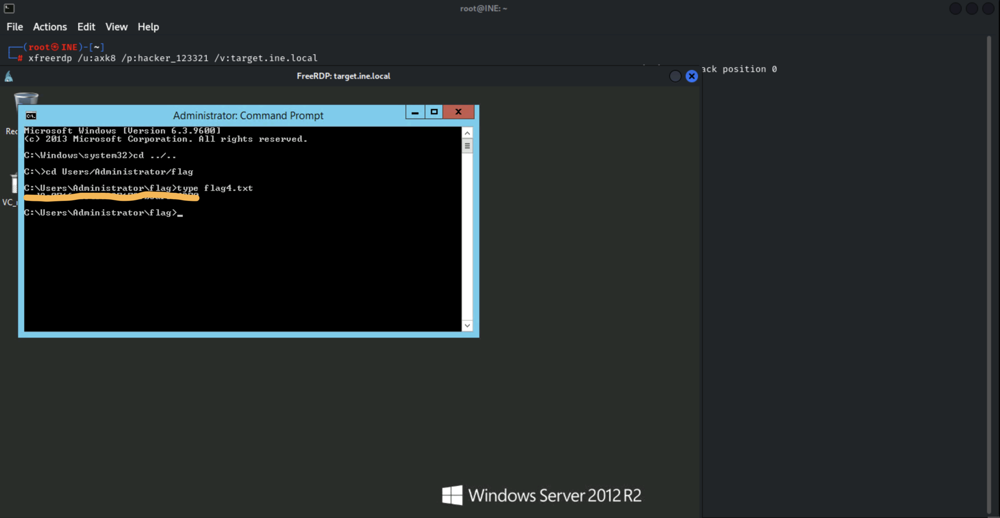
## Conclusion: 

Although this lab is fairly straightforward, the final flag prompted us to rethink how we’ve managed the resources we’ve acquired so far. Although we gained maximum privileges fairly quickly, we were faced with a scenario where a restriction forced us to explore different ways of interacting with the system, whilst ensuring we didn’t become complacent about the power of PrintSpoofer as it didn’t allow us to read a simple file. Always remember the resources you have at your disposal.

Thank you for reading, please note that this is my very first write-up, feedback is always appreciated.

 Happy hacking!
